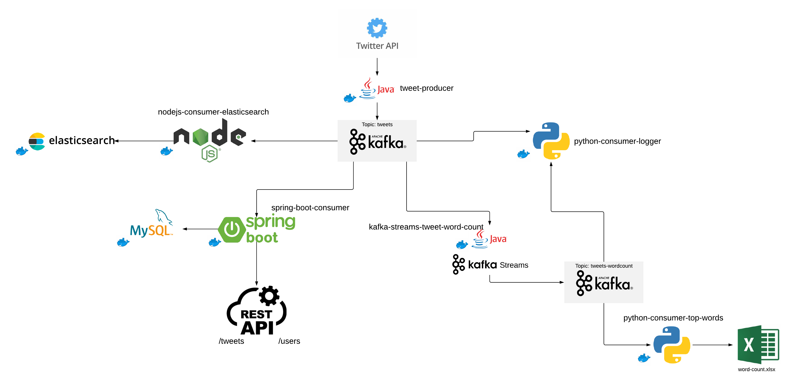

# hashtag-tracker
  An application used to analyze the users and their tweets to a given hashtag

# Architecure
  

# Prerequisites
  Please make sure that you have a .env file having the following entries at the root of the project.
  
  ```
  BEARER_TOKEN = YOUR_TWITTER_BEARER_TOKEN
  SPRING_DATASOURCE_URL = URL_OF_THE_MYSQL_DATABASE
  SPRING_DATASOURCE_USERNAME = MYSQL_USERNAME
  SPRING_DATASOURCE_PASSWORD = MYSQL_PASSWORD
  ```
